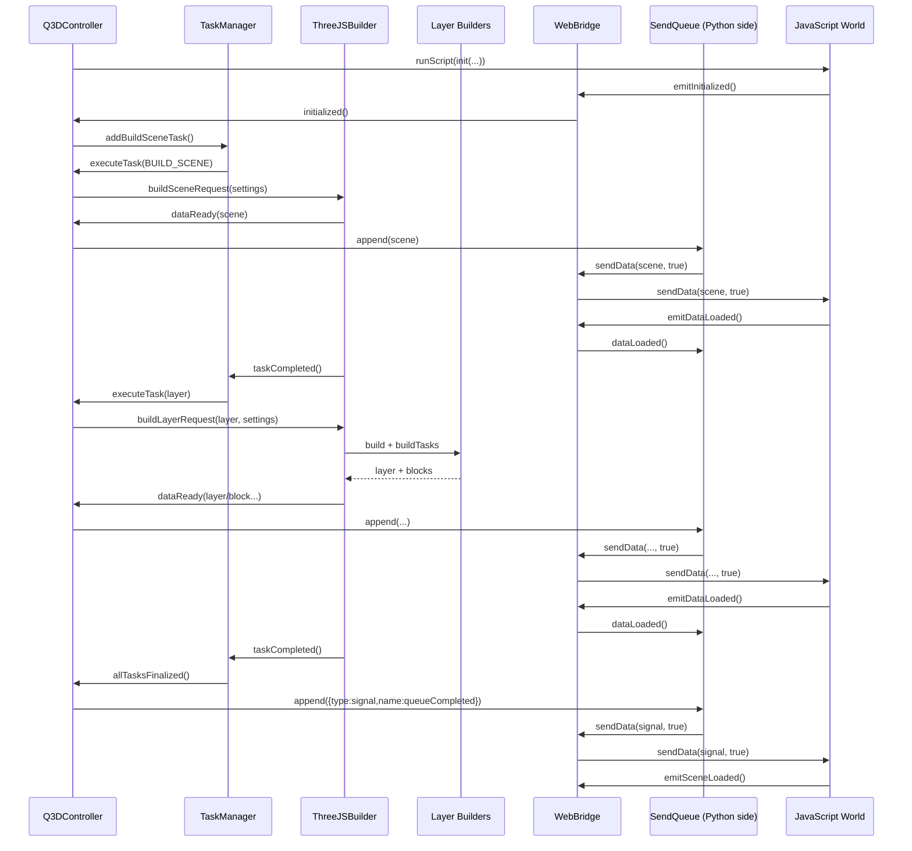

# Component Communication and Timing (Qgis2threejs)

Created: August 7, 2026

Note: This document was generated by AI (GitHub Copilot, GPT-5.3-Codex).
This document analyzes how data and signals move between the following components:

- Q3DController
- TaskManager
- ThreeJSBuilder
- Layer Builders
- WebBridge
- Web Page
- JavaScript World

It covers both communication content and timing.

## Scope and Source Files

Primary code paths used for this analysis:

- Controller and wiring:
  - [core/controller/controller.py](../core/controller/controller.py)
  - [core/controller/taskmanager.py](../core/controller/taskmanager.py)
- Build pipeline:
  - [core/build/builder.py](../core/build/builder.py)
  - [core/build/vector/builder.py](../core/build/vector/builder.py)
  - [core/build/vector/feature_block_builder.py](../core/build/vector/feature_block_builder.py)
  - [core/build/dem/builder.py](../core/build/dem/builder.py)
  - [core/build/dem/block_builder.py](../core/build/dem/block_builder.py)
  - [core/build/dem/material_builder.py](../core/build/dem/material_builder.py)
- Bridge and page transport:
  - [gui/webview/webbridge.py](../gui/webview/webbridge.py)
  - [gui/webview/webviewcommon.py](../gui/webview/webviewcommon.py)
  - [gui/webview/webengineview.py](../gui/webview/webengineview.py)
  - [gui/webview/sendqueue.py](../gui/webview/sendqueue.py)
- Web runtime:
  - [web/viewer/webengine.html](../web/viewer/webengine.html)
  - [web/src/preview.ts](../web/src/preview.ts)
  - [web/src/app.ts](../web/src/app.ts)
  - [web/src/scene.ts](../web/src/scene.ts)
  - [web/src/types.ts](../web/src/types.ts)

## Roles and Responsibilities

- Q3DController
  - Orchestrates lifecycle and task dispatch.
  - Converts user/settings state into build and script actions.
  - Forwards build outputs to the web page.
- TaskManager
  - Owns sequencing and queue state (`taskQueue`, `isTaskRunning`, dequeue counters).
  - Emits one task at a time and waits for completion/failure/abort.
- ThreeJSBuilder
  - Builds scene/layer payloads.
  - Streams payload chunks via `dataReady` and reports progress.
- Layer Builders
  - Generate type-specific payloads:
  - Vector: layer envelope plus feature blocks.
  - DEM: layer envelope plus DEM/material blocks.
- WebBridge
  - Python <-> JavaScript signal/slot gateway (Qt WebChannel object `bridge`).
- Web Page
  - Provides script execution, script-file loader, and queued data transport.
- JavaScript World
  - Applies scene/layer/block data to three.js scene.
  - Emits completion/ack signals back to Python.

## Signal Wiring (Who Connects to Whom)

Centralized in `ConnectionManager.setup()` in [core/controller/controller.py](../core/controller/controller.py):

### Web Page -> Controller

- `loadFinished(bool)` -> `Q3DController.pageLoaded(ok)`

### Web Bridge -> Controller

- `initialized()` -> `Q3DController.viewerInitialized()`

### Controller -> Builder

- `buildSceneRequest(ExportSettings)` -> `ThreeJSBuilder.buildSceneSlot(settings)`
- `buildLayerRequest(Layer, ExportSettings)` -> `ThreeJSBuilder.buildLayerSlot(layer, settings)`

### TaskManager -> Controller

- `executeTask(object)` -> `Q3DController.executeTask(task)`
- `abortCurrentTask()` -> `Q3DController.abortCurrentTask()`
- `allTasksFinalized()` -> `Q3DController.allTasksFinalized()`

### Builder -> Controller

- `dataReady(dict)` -> `Q3DController.appendDataToSendQueue(data)`
- `progressUpdated(int, int, str)` -> `Q3DController.builderProgressUpdated(...)`

### Builder -> TaskManager

- `taskCompleted()` -> `TaskManager.taskCompleted()`
- `taskFailed(str, str)` -> `TaskManager.taskFailed(target, traceback)`
- `taskAborted()` -> `TaskManager.taskAborted()`

### Web Bridge -> SendQueue

- `dataLoaded()` -> `SendQueue.dataLoaded()`

Important: `dataLoaded()` is consumed by the page-side queue (`SendQueue`) rather than directly by `Q3DController`.

## Communication Content (What Is Sent)

## 1) TaskManager Queue Items (Controller Commands)

Queue items are heterogeneous and include:

- `Task.BUILD_SCENE`
- `Task.UPDATE_SCENE_OPTS`
- `Task.RELOAD_PAGE`
- `Layer` object (build one layer)
- Script task dict: `{"type": "script", "script": "..."}`
- Data dict task (already-shaped payload to send)

## 2) Builder -> Controller Payloads (`dataReady`)

### Scene payload (from `ThreeJSBuilder.buildScene`)

```json
{
  "type": "scene",
  "properties": {
    "baseExtent": {"cx": 0, "cy": 0, "width": 0, "height": 0, "rotation": 0},
    "origin": {"x": 0, "y": 0, "z": 0},
    "zScale": 1,
    "light": "point|directional",
    "fog": {"color": 0, "density": 0.0},
    "proj": "..."
  }
}
```

### Layer envelope payloads

Vector and DEM layer builders emit:

```json
{
  "type": "layer",
  "id": 12,
  "properties": {"type": "dem|point|line|polygon", "...": "..."},
  "body": {"materials": [], "models": []}
}
```

Notes:

- Vector layer body typically includes `materials` or `models`.
- DEM layer envelope can be emitted without `body`; DEM details are usually streamed as blocks.

### Block payloads (streamed)

Vector block (from `FeatureBlockBuilder.build`):

```json
{
  "type": "block",
  "layer": 12,
  "block": 0,
  "featureCount": 200,
  "startIndex": 0,
  "features": [],
  "progress": 34
}
```

DEM block (from DEM block/material builders) may carry:

- geometry grid or mesh (`grid` or `mesh`),
- transform fields (`extent`, `translate`, `zScale`, `segments`),
- material update blocks (`materials`).

## 3) Controller -> Web Page -> JS Data Transport

- `Q3DController.sendData(data, viaQueue)` calls page `sendData(...)`.
- In WebEngine page, `sendData(..., viaQueue=True)` appends to `SendQueue`.
- `SendQueue` transmits one packet at a time with `bridge.sendData.emit(data, True)`.
- JS receives this through `pyObj.sendData.connect(...)` in `preview.ts` and calls `loadData(data, viaQueue)`.

## 4) Python -> JS Script Communication

Controller uses script calls for control-plane actions, including:

- `init(offScreen, DEBUG_MODE, QGIS_VERSION_INT)`
- `app.start()`
- scene option updates (`setOutlineEffectEnabled`, `setBackgroundColor`, coord flags)
- layer operations such as `hideLayer(...)`

Dynamic script dependencies are loaded through `loadScriptFiles(...)`, which chains `loadScriptFile(...)` calls and waits for JS to emit `pyObj.emitScriptReady(scriptFileId)`.

## 5) JS -> Python Signals (Bridge Events)

From `preview.ts`, JS emits:

- `emitInitialized()` after viewer bootstrap.
- `emitDataLoaded()` when one queued packet is fully loaded.
- `emitDataLoadError()` on load error event.
- `emitSceneLoaded()` when scene-loaded workflow completes.
- animation/render/test helper events (`emitTweenStarted`, `emitAnimationStopped`, etc.).

## Timing: End-to-End Sequences

## A) Initial Page Load and Viewer Bootstrap

1. Web view loads [web/viewer/webengine.html](../web/viewer/webengine.html).
2. Page imports preview runtime module and Qt WebChannel script.
3. `loadFinished` triggers `Q3DController.pageLoaded(ok)`.
4. Controller initializes task manager state, clears send queue, pushes config scripts, and runs `init(...)`.
5. JS `init(...)` binds `pyObj.sendData.connect(...)`, initializes `app`, and emits `emitInitialized()`.
6. Controller `viewerInitialized()` sends labels, runs `app.start()`, and queues build scene task.

## B) Task Dispatch and Build Pipeline

1. TaskManager queues scene/update/layer/script/data tasks.
2. `processNextTask()` arms a single-shot timer.
3. `_processNextTask()` dequeues one item and emits `executeTask(item)` with `isTaskRunning=True`.
4. Controller routes task by type:
   - scene -> `buildSceneRequest.emit(settingsCopy)`
   - layer -> optional script preloads then `buildLayerRequest.emit(layer, settingsCopy)`
   - script -> `runScript(..., callback=taskFinalized)`
   - data dict -> queue send then `taskFinalized()`
5. Builder emits `dataReady` packets during build and then emits exactly one terminal signal: completed/failed/aborted.
6. TaskManager finalizes and schedules the next task.

## C) Back-Pressure and Acknowledged Streaming

1. Each builder packet is forwarded with `viaQueue=True`.
2. Python `SendQueue` does not send packet N+1 until JS acks packet N.
3. JS marks queued packet loading with `loadingManager.itemStart("data")`/`itemEnd("data")`.
4. In preview runtime, `loadingManager.onLoad` is overridden to dispatch `loadComplete`.
5. On `loadComplete`, JS emits `emitDataLoaded()`.
6. Python `SendQueue.dataLoaded()` clears `isDataLoading` and sends next packet.

Practical timing detail: for packets that trigger async asset loads (textures/models), ack is delayed until those loads complete, not merely until synchronous parsing returns.

## D) Sequence Finalization

1. When TaskManager queue empties, it emits `allTasksFinalized()`.
2. Controller enqueues sentinel payload:

```json
{
  "type": "signal",
  "name": "queueCompleted",
  "success": true,
  "is_scene": true
}
```

3. JS handles this in `loadData` and calls `tasksAndLoadingFinalized(success, is_scene)`.
4. Progress UI fades out; if successful scene sequence, JS dispatches `sceneLoaded` asynchronously.
5. JS then emits `emitSceneLoaded()` to Python.

## E) Abort and Cancellation

1. Abort triggers `Q3DController.abort(...)`.
2. Queue may be cleared, task sequence status reset, and `SendQueue.clear()` called.
3. Builder abort flag is set and checked before each streamed block task.
4. Builder emits `taskAborted()`; TaskManager finalizes and proceeds/ends accordingly.

## Sequence Diagram (Nominal Scene + Layers)



## Improvement Opportunities

## 1) Controller Exception Path Can Stall Task Flow

In `Q3DController.executeTask()`, broad exceptions are logged, but the task manager is not explicitly finalized on that path.

Why this matters:

- `TaskManager.isTaskRunning` can remain `True`.
- Queue progression can stop until manual reset/reload.

Suggested improvement:

- In controller `except`, call `self.taskManager.taskFailed("controller", traceback_str)` or `self.taskManager.taskFinalized()`.

## 2) SendQueue Is Unbounded

`SendQueue` uses an unbounded `deque`.

Why this matters:

- Large/slow scenes can accumulate many pending blocks.
- Memory growth is unconstrained under JS-side back-pressure.

Suggested improvement:

- Add high-water/low-water thresholds and adaptive throttling.
- Optionally coalesce small packets.
- Expose queue length telemetry for diagnostics.

## 3) Error-Ack Behavior Should Be Explicit

Queue progression depends on `dataLoaded` ack. JS emits `dataLoadError`, but Python queue logic only listens to `dataLoaded`.

Why this matters:

- If a load-error path skips `loadComplete` in some scenarios, queue can stall.
- Failure policy is currently implicit.

Suggested improvement:

- Define explicit policy for error ack:
  - either treat `dataLoadError` as terminal and clear/fail sequence,
  - or convert it into an ack-equivalent event for queue progression.
- Optionally connect `dataLoadError` to a controller/task failure path.

## 4) Abort Granularity in Heavy Inner Loops

Abort checks are present at block-task boundaries, but not uniformly inside all heavy loops.

Why this matters:

- User abort may feel delayed for very large feature/material operations.

Suggested improvement:

- Add periodic abort checks inside long-running vector/DEM inner loops.

## 5) Point Cloud Path Is Not Explicit in LayerBuilderFactory

`LayerType.POINTCLOUD` exists in constants, but `LayerBuilderFactory` maps DEM/POINT/LINESTRING/POLYGON only.

Why this matters:

- Point-cloud payload contract and dispatch behavior are not explicit.
- Current fallback behavior may be accidental rather than intentional.

Suggested improvement:

- Add explicit point-cloud builder mapping, or document fallback behavior and payload schema clearly.

## 6) Sequence Completion Semantics Could Be Stronger

`queueCompleted` reflects TaskManager queue completion, while JS loading completion is tracked separately by load manager callbacks.

Why this matters:

- Completion semantics span two asynchronous systems (task queue and web loading).

Suggested improvement:

- Document and enforce a strict definition of "done" (task queue empty + send queue drained + JS load complete).
- Consider a dedicated final ack payload from JS including summary counters.

## Summary

The current architecture is clear and mostly robust:

1. TaskManager serializes work.
2. Q3DController dispatches and mediates all control/data paths.
3. ThreeJSBuilder and layer builders stream scene/layer/block payloads.
4. SendQueue + WebBridge enforce one-at-a-time, ack-paced delivery.
5. JS applies payloads and reports lifecycle events back to Python.

The highest-value improvements are controller exception finalization, explicit error-ack semantics, and bounded queue/back-pressure controls.

---

Please analyze the codebase of this project and explain the data and signal communication between the following components, including both the content of the communication and its timing:

- Q3DController
- TaskManager
- ThreeJSBuilder
- Layer Builders
- WebBridge
- Web Page
- JavaScript World

If there are any aspects of the data or signal communication that could be improved, please include an explanation of those potential improvements as well.

Please provide the explanation as a Markdown file.
