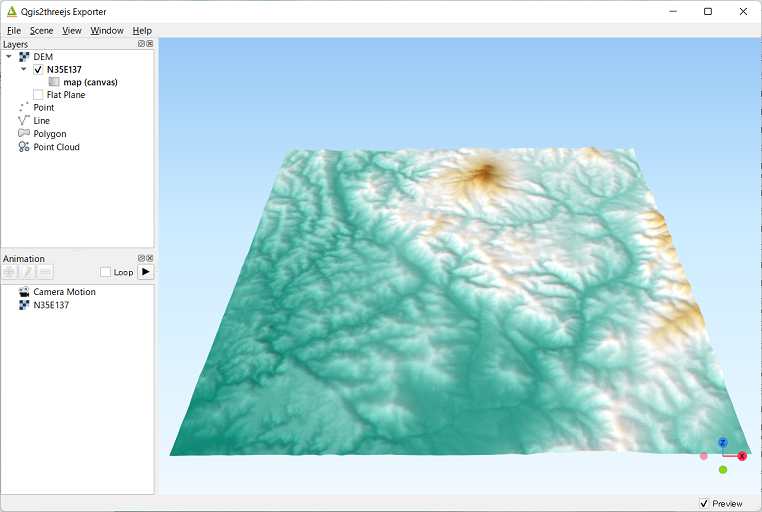
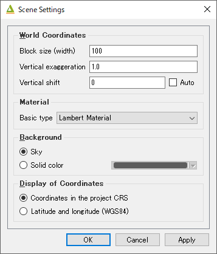
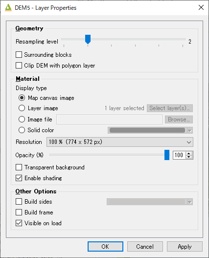
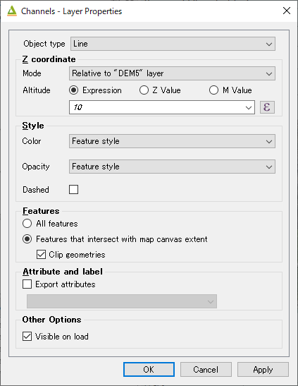
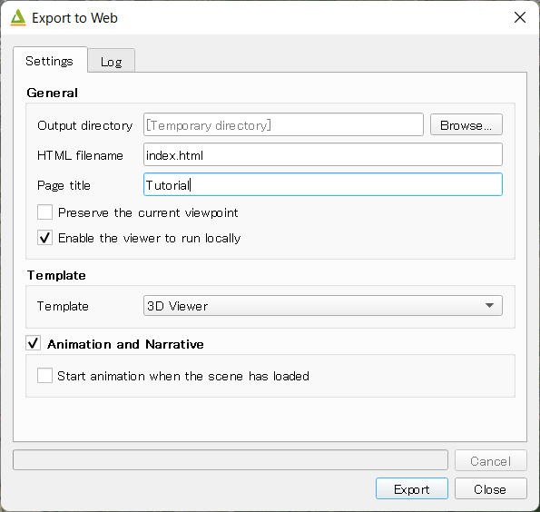
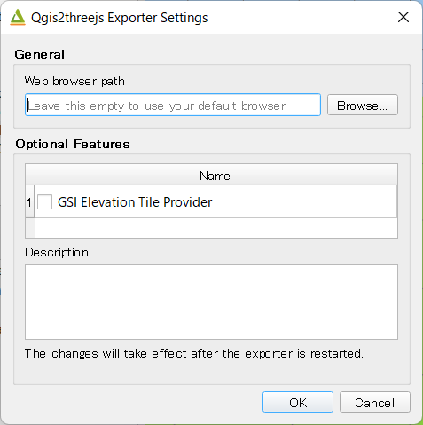

Exporter
========

.. contents:: Contents
   :local:
   :depth: 1

Window
------

Qgis2threejs exporter window has `Layers` panel on the left side and preview on the right side.

In this plugin, the word "export settings" means all configuration settings for a 3D scene,
which consist of scene settings, camera settings, each layer settings and so on.
You can configure them via `Scene <#scene>`__ menu, `Layers` panel and `Export to Web` dialog.

In the `Layers` panel, each layer item has a checkbox on its left. Check the checkbox to add the layer to current scene.
To open layer properties dialog and configure settings for the layer, double-click on the layer item or click on
`Properties` from context menu (right click menu).

Export settings are automatically saved to a ``.qto3settings`` file under the same directory
as the currently open project file if you are working with a project file. When you open the exporter later,
the export settings of the project will be restored.

If you don't want to use preview, uncheck `Preview` checkbox in the lower right corner of the window.
For example, you might want to uncheck it to avoid waiting for updating 3D objects in the scene for each export settings update,

Menu
^^^^

* File

   * Export to Web...
      Exports files necessary for publishing current scene to web. See `Export to Web Dialog <#export-to-web-dialog>`__
      section.

   * Save Scene As - Image (.png)
      Saves rendered scene image to a PNG file.

   * Save Scene As - glTF (.gltf,.glb)
      Saves 3D model of current scene in glTF format.

   * Exporter Settings...
      Opens Exporter Settings dialog. See `Exporter Settings Dialog <#exporter-settings>`__

   * Close Exporter
      Closes Qgis2threejs Exporter.

* Scene

   * Scene Settings...
      Opens Scene settings dialog. See `Scene Settings <#scene-settings>`__ section.

   * Camera
      Changes the camera. See `Camera Settings <#camera-settings>`__ section.

   * Controls
      Changes the controls. See `Controls Settings <#controls-settings>`__ section.

   * Decorations
      Add decorations to the view, such as North arrow and footer label.
      See `Decorations <#decorations>`__ section.

   * Clear All Settings
      Clears current export settings.

   * Reload (F5)
      Reloads current scene.

   * Reset Camera Position (Shift+R)
      Returns camera position to initial position and resets its view target to initial point (3D world origin).

* Window

   * Panels
      * Layers
          Toggles Layers panel visibility.

      * Console
          Toggles console panel visibility.
          Console panel displays information for debugging, mainly JavaScript side information.
          Python side debug information is logged to log messages panel in QGIS window.
          You can enter and execute JavaScript statements.

   * Always on Top
      Brings the exporter window to front of all other application windows.

* Help

   * Help
      Opens the plugin document in default browser. Internet connection is required.

   * Plugin Homepage
      Opens the plugin homepage in default browser. Internet connection is required.

   * Send feedback
      Opens the plugin issue tracking system in default browser. Internet connection is required.

   * About Qgis2threejs Plugin
      Displays the plugin version you are using.

Scene Settings
--------------

Scene settings dialog controls some basic configuration settings for current scene.
Click on ``Scene - Scene Settings...`` menu entry to open the dialog.

* World Coordinates

    * Base size (width)

        Size (width) in 3D world that corresponds to the map canvas width. The
        default value is 100.

    * Vertical exaggeration

        Vertical exaggeration factor. This value affects terrain shape and z
        positions of all vector 3D objects. This also affects 3D object height
        of some object types with volume. Object types to be affected:

         | Point : Cylinder, Cube, Cone
         | Polygon : Extruded

        3D objects of the following types have volume, but their heights aren't
        affected by this factor:

         | Point : Sphere
         | Line : Pipe, Cone, Box

        The default value is 1.0.

    * Vertical shift

        Vertical shift for all objects. If you want to export high altitude
        and narrow area, you should adjust the object positions to be
        displayed at the center of browser by changing this value. If you set
        the value to -1000, all objects are shifted down by 1000 in the unit of
        map CRS.

* Material

    * Basic type

        MateMaterial type applied to most 3D objects, except for Point, Icon, Model File and Line type objects.
        Select a material type from
        `Lambert material <https://threejs.org/docs/#api/en/materials/MeshLambertMaterial>`__,
        `Phong material <https://threejs.org/docs/#api/en/materials/MeshPhongMaterial>`__ and
        `Toon material <https://threejs.org/docs/#api/en/materials/MeshToonMaterial>`__.
        Default is Lambert material.

* Background

   Select either sky-like gradient or a solid color for the scene background.
   Default is Sky.

* Display of coordinates

   If the ``Latitude and longitude (WGS84)`` option is selected,
   coordinates of clicked position on a 3D object are displayed in
   longitude and latitude (WGS84). If
   `Proj4js <https://github.com/proj4js/proj4js>`__ doesn't support current
   map CRS, this option is disabled.

Camera Settings
---------------

* Perspective Camera

    Renders closer objects as bigger and farther objects as smaller.

* Orthographic Camera

    Rendered object size doesn't depend on the distance from the camera.

Controls Settings
-----------------

OrbitControls is available.

===== ======================================================== ===========================
Ctrl  Mouse / Keys                                             Touch                      
===== ======================================================== ===========================
Orbit Left mouse                                               One-finger move            
Zoom  Middle mouse, or mousewheel                              Two-finger spread or squish
Pan   Right mouse, or left mouse + ctrl/metaKey, or arrow keys Two-finger move            
===== ======================================================== ===========================

Decorations
-----------

* North arrow

   Adds an arrow that indicates the direction of grid North at the lower-left corner of the web page.

* Header/Footer label

   Adds a header label to top-left corner of the web page and/or a footer label to lower-left corner.
   Label text can contain valid HTML tags for styling.

DEM Layer Settings
------------------

Geometry
^^^^^^^^

* Resampling level

   Select a DEM resolution from several levels. This resolution is used to
   resample the DEM, but is not for texture.

* Surrounding blocks

   This option enlarges output DEM by placing DEM blocks around the main block of the map canvas extent.
   Size can be selected from odd numbers in the range of 3 to 9. If you select 3, total 9 (=3x3) blocks
   (a center block and 8 surrounding blocks) are output. Roughness can be selected from powers of 2 in
   the range of 1 to 64. If you select 2, grid point spacing of each surrounding block is doubled. It
   means that the number of grid points in the same area becomes 1/4.

* Clip DEM with polygon layer

   Clips the DEM with a polygon layer. If you have a polygon layer that
   represents the area that elevation data exist or represents drainage basins,
   you might want to use this option.

Material
^^^^^^^^

* Display type

   You can choose from map canvas image, layer image, a image file or a
   solid color.

   * Map canvas image

      Render a texture image with the current map settings for each DEM block.

   * Layer image

      Render a texture image with the selected layer(s) for each DEM block.

   * Image file

      Textures the main DEM block with existing image file such as PNG file and JPEG file.
      TIFF is not supported by some browser. See `Image format
      support <https://en.wikipedia.org/wiki/Comparison_of_web_browsers#Image_format_support>`__
      for details.

   * Solid color

      To select a color, press the button on the right side.

* Resolution

   Increases the size of image applied to each DEM block. This option is enabled when
   either ``Map canvas image`` or ``Layer image`` is selected. You can select a ratio
   to map canvas size from 100, 200 and 400 (%). Image size in pixels follows the percent.

* Opaciy

   Sets opacity of DEM object. 100 is opaque, and 0 is transparent.

* Transparent background (When map canvas image or layer image is chosen)

   Makes image background transparent.

* Enable transparency (When image file is chosen)

   Enables image transparency.

* Enable shading

   Adds a shading effect to DEM surface.

Other Options
^^^^^^^^^^^^^

* Build sides

   This option adds sides and bottom to each DEM block. The z position of bottom
   in the 3D world is fixed. You can adjust the height of sides by changing
   the value of vertical shift option in the World panel. If you want to
   change color, edit the output JS file directly.

* Build frame

   This option adds frame to the DEM. If you want to change color, edit the output
   JS file directly.

* Visible on Load

   Whether the layer is visible on page load or not.

Vector Layer Settings
---------------------

Vector layers are grouped into three types: Point, Line and Polygon.
Common settings for all types:

* Z coordinate

   * Altitude Mode

      * Absolute

         Altitude is distance above zero-level.

      * Relative to (a DEM layer)

         Altitude is distance above surface of selected DEM.

   * Altitude

      You can use an expression to define altitude of objects above zero-level or
      surface of selected DEM layer. This means that object altitude can be defined
      using field values. The unit is that of the map CRS.

      * Expression

         A numeric value, field or more complex expression (QGIS expressions).

      * Z value / M value

         Uses z coordinate or m value of each vertex. the evaluated value is added to it.

         These options can be chosen when the layer geometries have z coordinates or m values.
         Cannot be chosen when the object type is Extruded or Overlay.

* Style

   Usually, there are options to set object color and transparency. Refer
   to the links below for each object type specific settings. The unit of
   value for object size is that of the map CRS.

* Feature

   Select the features to be exported.

   * All features

      All features of the layer are exported.

   * Features that intersect with map canvas extent

      Features on the map canvas are exported.

      * Clip geometries

         This option is available with Line/Polygon layer. If checked, geometries are clipped by the extent of map canvas.

* Attribute and label

   If the export attributes option is checked, attributes are exported with
   feature geometries. Attributes are displayed when you click an object on
   web browser.

   If a field is selected in the label combobox, a label is displayed above
   each object and is connected to the object with a line. This combo box
   is not available when layer type is line.

Point
^^^^^

Point layers in the project are listed as the child items. The following
object types are available:

    Sphere, Cylinder, Cone, Box, Disk, Plane, Model File

See :ref:`object-types-point-layer` section in :doc:`ObjectTypes` page for each object type specific settings.

Line
^^^^

Line layers in the project are listed as the child items. The following
object types are available:

    Line, Pipe, Cone, Box, Wall

See :ref:`object-types-line-layer` section in :doc:`ObjectTypes` page for each object type specific settings.

Polygon
^^^^^^^

Polygon layers in the project are listed as the child items. The
following object types are available:

    Polygon, Extruded, Overlay

See :ref:`object-types-polygon-layer` section in :doc:`ObjectTypes` page for each object type specific settings.

.. _export_web_dialog:

Export to Web Dialog
--------------------

* Output directory and HTML Filename

   Select output HTML file path. Usually, a js file with the same file
   title that contains whole data of geometries and images is output into
   the same directory, and some JavaScript library files are copied
   into the directory. Leave this empty to output into temporary
   directory. Temporary files are removed when you close the QGIS
   application.

* Export button

   Exporting starts when you press the Export button. When the exporting has
   been done and `Open exported page in web browser` option is checked, the
   exported page is opened in default web browser (or a web browser specified
   in `Exporter Settings <#exporter-settings>`__).

* Template

   Select a template from available templates:

    * 3DViewer

       This template is a 3D viewer without any additional UI library.

    * 3DViewer(dat-gui)

       This template has a `dat-gui <https://code.google.com/p/dat-gui/>`__
       panel, which makes it possible to toggle layer visibility, adjust layer
       opacity and add a horizontal plane movable in the vertical direction.

    * Mobile

       This is a template for mobile devices, which has mobile friendly GUI,
       device orientation controls and AR feature. In order to use the AR feature
       (Camera and GPS), you need to upload exported files to a web server that
       supports SSL.

       Option

       * Magnetic North Direction
           Magnetic North direction clockwise from the upper direction of the map, in degrees.
           This value will be set to 0 if map canvas is rotated so that magnetic North direction is
           same as the map upper direction. Otherwise, the value should be determined taking account of
           grid magnetic angle (angle between grid North and magnetic North) and map rotation.
           Used to determine device camera direction.

* General Settings

    * Preserve the Current Viewpoint

        If checked, the current viewpoint of the preview is used as initial viewpoint.

    * Enable the Viewer to Run Locally

        If checked, export all scene data to a .js file to avoid web browser's same origin policy
        security restrictions. You can view the exported scene without uploading it to a web
        server, although the total file size will increase and it will take longer to load.

Exporter Settings
-----------------

* Web browser path

   If you want to run the exported viewer with a web browser other than the default browser,
   enter path to the web browser in this input box.
   See `Browser Support <https://github.com/minorua/Qgis2threejs/wiki/Browser-Support>`__ wiki page.

* Optional Features

    See `Plugins <https://github.com/minorua/Qgis2threejs/wiki/Plugins>`__ wiki page.
