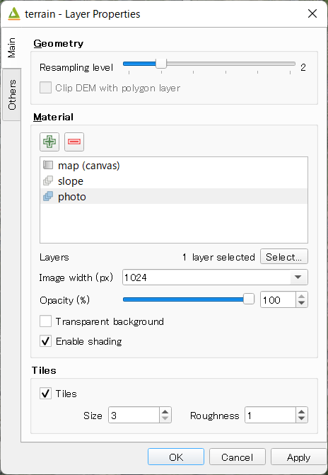
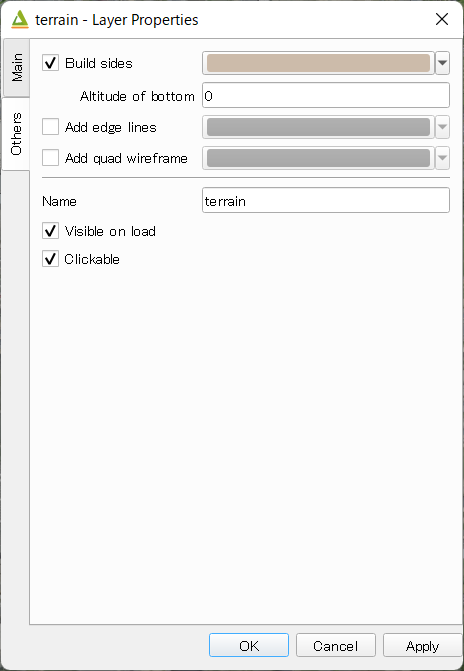
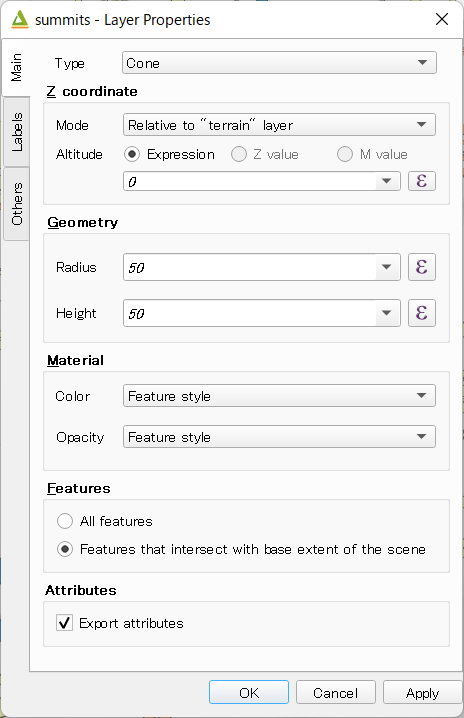
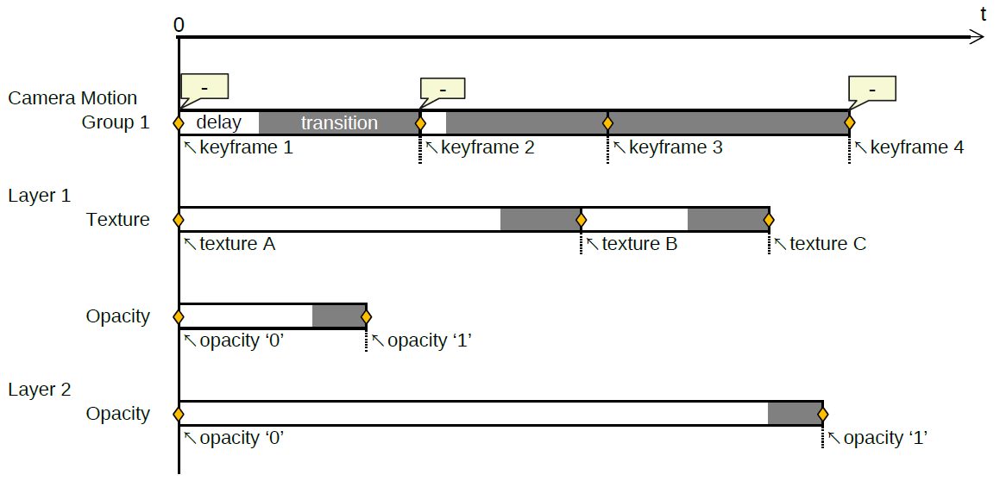
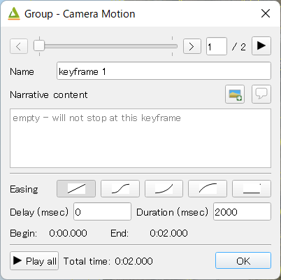

Exporter
========

.. contents:: Contents
   :local:
   :depth: 1

Window
------

Qgis2threejs exporter window has `Layers` panel and `Animation` panel on the left side, and preview on the right side.

.. image:: ./images/exporter1.png

In this plugin, the word "export settings" means all configuration settings for a 3D scene and its viewer application,
which consist of settings for scene, camera, every layer to export, animation, widgets on web page and so on.
You can configure them via `Scene <#scene>`__ menu, `Layers` panel, `Animation` panel, `View` menu and `Export to Web` dialog.

In the `Layers` panel, each layer item has a checkbox on its left. Check the checkbox to add the layer to current scene.
To open layer properties dialog and configure settings for the layer, double-click on the layer item or click on
`Properties...` from context menu (right click menu).

Export settings are automatically saved to a ``.qto3settings`` file alongside the current QGIS project file if you are working
with a QGIS project file. When you open the exporter later, the export settings of the project will be restored.

If you don't want to use preview, uncheck `Preview` checkbox in the lower right corner of the window.
You might want to uncheck it to avoid waiting for updating 3D objects in the scene for each export settings update.

Menu
^^^^

* File

   * Export to Web...
      Exports files for publishing current scene to web. See `Export to Web Dialog <#export-to-web-dialog>`__
      section.

   * Save Scene As

      * Image (.png)...
         Saves rendered scene image to a PNG file.

      * glTF (.gltf,.glb)...
         Saves 3D model of current scene in glTF format.

   * Export Settings

      * Load...
         ✏

      * Save...
         ✏

      * Clear...
         Clears current export settings.

   * Exporter Settings...
      Opens Exporter Settings dialog. See `Exporter Settings Dialog <#exporter-settings>`__

   * Close
      Closes Qgis2threejs Exporter.

* Scene

   * Scene Settings...
      Opens Scene settings dialog. See `Scene Settings <#scene-settings>`__ section.

   * Add Layer

      * Add Flat Plane
         ✏

      * Add Point Cloud Layer...
         ✏

   * Reload (F5)
      Reloads current scene.

* View

   * Camera
      Changes the camera. See `Camera Settings <#camera-settings>`__ section.

   * Widgets
      Configures widgets to be place on web page, such as Navigation widget, North arrow and footer label.
      See `Widgets <#widgets>`__ section.

   * Reset Camera Position (Shift+R)
      Returns to the initial camera position and resets its focal point to the initial point.

* Window

   * Panels

      * Layers
         Toggles `Layers` panel visibility.

      * Animation
         Toggles `Animation` panel visibility.

      * Console
         Toggles `Console` panel visibility.
         Console panel displays information for debugging, mainly JavaScript side information.
         Python side debug information is logged to log messages panel in QGIS window.
         You can enter JavaScript statements and execute them.

   * Always on Top
     Brings the exporter window to front of all other application windows.

* Help

   * Usage of 3D Viewer

     ✏

   * Help Contents
     Opens the plugin document in default browser. Internet connection is required.

   * Plugin Homepage
     Opens the plugin homepage in default browser. Internet connection is required.

   * Send Feedback
     Opens the plugin issue tracking system in default browser. Internet connection is required.

   * About Qgis2threejs Plugin...
     Displays the plugin version you are using.

Scene Settings
--------------

Scene settings dialog controls some basic configuration settings for current scene.
Click on ``Scene - Scene Settings...`` menu entry to open the dialog.

.. image:: ./images/dialogs/scene_settings.png
    :scale: 50%
    :align: right

* World Coordinates

   * Origin of xy-plane

      ``Center of base extent``
      ``Origin of map coordinate system``

   * Z exaggeration

      Vertical exaggeration factor. This value affects terrain shape and z
      positions of all vector 3D objects. This also affects 3D object height
      of some object types with volume. Shape types to be affected:

       | Point : Cylinder, Cube, Cone
       | Polygon : Extruded

      The following shape types have volume, but their heights aren't
      affected by this factor:

       | Point : Sphere
       | Line : Pipe, Cone, Box

      The default value is 1.0.

* Base Extent

   * Use map canvas extent

   * Fixed extent

   * Fix aspect ratio to 1:1
     Checked by default since version 2.7.

* Background

   Select either sky-like gradient or a solid color for the scene background.
   Default is Sky.

* Display of coordinates

   If the ``Latitude and longitude (WGS84)`` option is selected,
   coordinates of clicked position on a 3D object are displayed in
   longitude and latitude (WGS84). If
   `Proj4js <https://github.com/proj4js/proj4js>`__ doesn't support current
   map CRS, this option is disabled.

.. image:: ./images/dialogs/scene_settings2.png
    :scale: 50%

* Light
  ``Directional light from the lower left of the 2D map``
  ``Point light above the camera``

* Fog
  Color and density.

* Material & Effect

   * Basic material type

      Material type applied to most 3D objects, except for Point, Icon, Model File and Line type objects.
      Select a material type from
      `Lambert material <https://threejs.org/docs/#api/en/materials/MeshLambertMaterial>`__,
      `Phong material <https://threejs.org/docs/#api/en/materials/MeshPhongMaterial>`__ and
      `Toon material <https://threejs.org/docs/#api/en/materials/MeshToonMaterial>`__.
      Default is Lambert material.

   * Enable outline effect

Camera Settings
---------------

* Perspective Camera

   Renders closer objects as bigger and farther objects as smaller.

* Orthographic Camera

   Rendered object size doesn't depend on the distance from the camera.

.. |persp| image:: ./images/camera/perspective.png
    :alt: perspective camera

.. |ortho| image:: ./images/camera/orthographic.png
    :alt: orthographic camera

=================== ===================
Perspective camera  Orthographic camera
------------------- -------------------
|persp|             |ortho|
=================== ===================

Controls Settings
-----------------

OrbitControls is available.

===== ======================================================== ===========================
Ctrl  Mouse / Keys                                             Touch
===== ======================================================== ===========================
Orbit Left mouse                                               One-finger move
Zoom  Middle mouse, or mousewheel                              Two-finger spread or squish
Pan   Right mouse, or left mouse + ctrl/metaKey, or arrow keys Two-finger move
===== ======================================================== ===========================

Widgets
-------

* Navigation widget

  ✏

* North arrow

   Adds an arrow that indicates the direction of grid North at the lower-left corner of the web page.

* Header/Footer label

   Adds a header label to top-left corner of the web page and/or a footer label to lower-left corner.
   Label text can contain valid HTML tags for styling.

DEM Layer Settings
------------------

Geometry
^^^^^^^^

* Resampling level

   Select a DEM resolution from several levels. This resolution is used to
   resample the DEM, but is not for texture.

* Clip DEM with polygon layer

   Clips the DEM with a polygon layer. If you have a polygon layer that
   represents the area that elevation data exist or represents drainage basins,
   you might want to use this option.

Material
^^^^^^^^

✏

The material list has one item ``map (canvas)`` by default.
You can add a material to the list by clicking + button, selecting one of ``Select layer(s)``, ``Image file``,
``Solid color`` and ``Map canvas layers``.

* Map canvas layers

   Render a texture image with the current map settings for each DEM block.

* Layer image(s)

   Render a texture image with the selected layer(s) for each DEM block.

* Image file

   Textures the main DEM block with existing image file such as PNG file and JPEG file.
   TIFF is not supported by some browser. See `Image format
   support <https://en.wikipedia.org/wiki/Comparison_of_web_browsers#Image_format_support>`__
   for details.

* Solid color

   To select a color, press the button on the right side.

* Image width (px)

   Select width of image draped on each DEM block. Default value is 1024.

* Opaciy

   Sets opacity of DEM object. 100 is opaque, and 0 is transparent.

* Transparent background

   When map canvas image or layer image is chosen

   Makes image background transparent.

* Enable shading

   Adds a shading effect to DEM surface. Checked by default.

Tiles
^^^^^

✏

* Tiles

   This option enlarges output DEM by placing DEM blocks around the main block of the map canvas extent.
   Size can be selected from odd numbers in the range of 3 to 9. If you select 3, total 9 (=3x3) blocks
   (a center block and 8 surrounding blocks) are output. Roughness can be selected from powers of 2 in
   the range of 1 to 64. If you select 2, grid point spacing of each surrounding block is doubled. It
   means that the number of grid points in the same area becomes 1/4.

Other Options
^^^^^^^^^^^^^

* Build sides

   This option adds sides and bottom to each DEM block. The z position of bottom
   in the 3D world is fixed. You can adjust the height of sides by changing
   the value of vertical shift option in the World panel. If you want to
   change color, edit the output JS file directly.

* Add edge lines

   This option adds frame to the DEM. If you want to change color, edit the output
   JS file directly.

* Add quad wireframe

* Name

* Visible on Load

   Whether the layer is visible on page load or not.

* Clickable

Vector Layer Settings
---------------------

Vector layers are grouped into three types: Point, Line and Polygon.
Common settings for all types:

* Type

  Select a shape type.

* Z coordinate

   * Altitude Mode

      * Absolute

         Altitude is distance above zero-level.

      * Relative to (a DEM layer)

         Altitude is distance above surface of selected DEM.

   * Altitude

      You can use an expression to define altitude of objects above zero-level or
      surface of selected DEM layer. This means that object altitude can be defined
      using field values. The unit is that of the map CRS.

      * Expression

         A numeric value, field or more complex expression (QGIS expressions).

      * Z value / M value

         Uses z coordinate or m value of each vertex. the evaluated value is added to it.

         These options can be chosen when the layer geometries have z coordinates or m values.
         Cannot be chosen when the object type is Extruded or Overlay.

* Geometry and Material

   Usually, there are options to set object color and transparency. Refer
   to the links below for each object type specific settings. The unit of
   value for object size is that of the map CRS.

* Feature

   Select the features to be exported.

   * All features

      All features of the layer are exported.

   * Features that intersect with map canvas extent

      Features on the map canvas are exported.

      * Clip geometries

         This option is available with Line/Polygon layer. If checked, geometries are clipped by the extent of map canvas.

* Attributes

   If the export attributes option is checked, attributes are exported with
   feature geometries. Attributes are displayed when you click an object on
   web browser.

.. image:: ./images/dialogs/vector_layer2.png
    :scale: 50%

* Labels

   This combo box is not available when layer type is line.

   * Show labels
     a label is displayed above each object.
   * Position
   * Text
   * Fill background
   * Connector

.. image:: ./images/dialogs/vector_layer3.png
    :scale: 50%

* Others

  * Name

  * Visible on Load

    Whether the layer is visible on page load or not.

  * Clickable

Point
^^^^^

Point layers in the project are listed as the child items. The following
shape types are available:

   Sphere, Cylinder, Cone, Box, Disk, Plane, Model File

See :ref:`object-types-point-layer` section in :doc:`ObjectTypes` page for each object type specific settings.

Line
^^^^

Line layers in the project are listed as the child items. The following
shape types are available:

   Line, Pipe, Cone, Box, Wall

See :ref:`object-types-line-layer` section in :doc:`ObjectTypes` page for each object type specific settings.

Polygon
^^^^^^^

Polygon layers in the project are listed as the child items. The
following shape types are available:

   Polygon, Extruded, Overlay

See :ref:`object-types-polygon-layer` section in :doc:`ObjectTypes` page for each object type specific settings.

.. image:: ./images/dialogs/vector_layer3.png
    :scale: 50%

Point Cloud Layer Settings
--------------------------

✏

* Information

* Material

  * Color type

  * Opacity

* Other options
  * Name
  * Show bounding boxes
  * Visible on load
  * Clickable

.. _animation:

Animation
---------

Animation panel
^^^^^^^^^^^^^^^

✏

* Camera Motion

  Group and keyframe item.

* Layer

  * Texture change
  * Growing line
  * Change opacity

* Tween

Keyframe dialog
^^^^^^^^^^^^^^^

✏

.. _export_web_dialog:

Export to Web Dialog
--------------------

.. image:: ./images/dialogs/export_to_web.png
   :width: 50%

* Output directory and HTML Filename

   Select output HTML file path. Usually, a js file with the same file
   title that contains whole data of geometries and images is output into
   the same directory, and some JavaScript library files are copied
   into the directory. Leave this empty to output into temporary
   directory. Temporary files are removed when you close the QGIS
   application.

* Page title

  ✏

* Preserve the Current Viewpoint

  If checked, the current viewpoint of the preview is used as initial viewpoint.

* Enable the Viewer to Run Locally

  If checked, export all scene data to a .js file to avoid web browser's same origin policy
  security restrictions. You can view the exported scene without uploading it to a web
  server, although the total file size will increase and it will take longer to load.

* Template

   Select a template from available templates:

   * 3DViewer

      This template is a 3D viewer without any additional UI library.

   * 3DViewer(dat-gui)

      This template has a `dat-gui <https://code.google.com/p/dat-gui/>`__
      panel, which makes it possible to toggle layer visibility, adjust layer
      opacity and add a horizontal plane movable in the vertical direction.

   * Mobile

      This is a template for mobile devices, which has mobile friendly GUI,
      device orientation controls and AR feature. In order to use the AR feature
      (Camera and GPS), you need to upload exported files to a web server that
      supports SSL.

      * Magnetic North Direction
         Magnetic North direction clockwise from the upper direction of the map, in degrees.
         This value will be set to 0 if map canvas is rotated so that magnetic North direction is
         same as the map upper direction. Otherwise, the value should be determined taking account of
         grid magnetic angle (angle between grid North and magnetic North) and map rotation.
         Used to determine device camera direction.

* Animation and Narrative

   ✏

   * Start animation once the scene has been loaded

* Export button

   Exporting starts when you press the Export button. When the exporting has
   been done and `Open exported page in web browser` option is checked, the
   exported page is opened in default web browser (or a web browser specified
   in `Exporter Settings <#exporter-settings>`__).

Exporter Settings
-----------------

.. image:: ./images/dialogs/plugin_settings.png
   :width: 50%

* Web browser path

   If you want to run the exported viewer with a web browser other than the default browser,
   enter path to the web browser in this input box.
   See `Browser Support <https://github.com/minorua/Qgis2threejs/wiki/Browser-Support>`__ wiki page.

* Optional Features

   See `Plugins <https://github.com/minorua/Qgis2threejs/wiki/Plugins>`__ wiki page.
