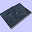

Short Guide
===========

1. Open the QGIS plugin dialog (```Plugins > Manage and install plugins...```), and then install Qgis2threejs plugin.

2. Load a raster DEM file using `Add Raster Layer` and any other layers into QGIS, and set the project CRS to a projected coordinate system (the unit should be the same as that of DEM values).

3. Zoom to your favorite place, and click the plugin button in the web toolbar. 

4. Click Run button in the dialog.

  

Then 3D terrain appears in your web browser!
