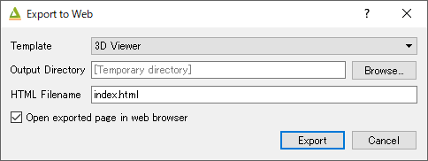
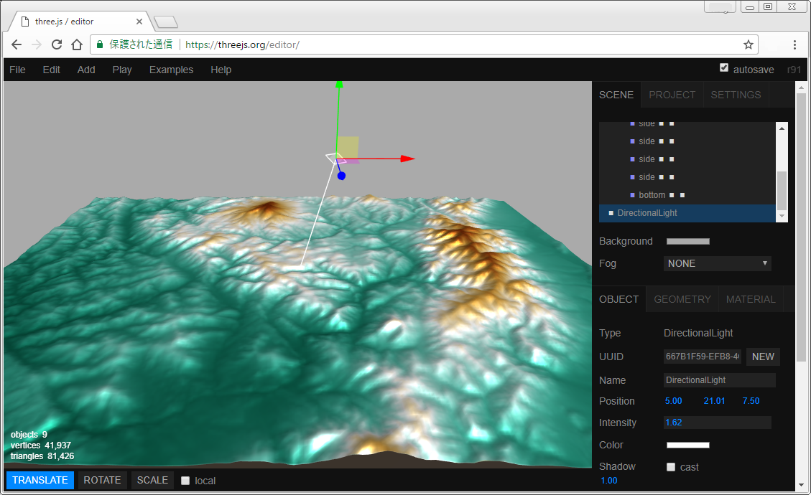

Tutorial
========

Let's start using Qgis2threejs plugin!

Install the plugin
------------------

Open the Plugin Manager (``Plugins > Manage and Install Plugins...``) and
install Qgis2threejs plugin.

.. hint:: Need help? See the `10.1.2. Installing New Plugins`__ section of
   the QGIS training manual.

__ http://docs.qgis.org/2.18/en/docs/training_manual/qgis_plugins/fetching_plugins.html#basic-fa-installing-new-plugins

Obtain elevation data
---------------------

If you already have raster DEM data, you can skip this step.

NASA released elevation data generated from NASA's
`Shuttle Radar Topography Mission`__ digital topographic data.
We can use the data freely. Elevation data version 2.1 can be
downloaded from the `distribution site`__.

__ http://www2.jpl.nasa.gov/srtm/index.html
__ https://dds.cr.usgs.gov/srtm/

Download a zip file that contains elevation data of the area you are
interested in from under the ``version2_1/SRTM3`` directory. The zip
file contains a ``.hgt`` file, which is readable by the GDAL.

..
  .. tip:: If the area extends over two or more files, you might want to
      create a virtual mosaic using `Build Virtual Raster (Catalog)`__
      tool of GdalTools.
  __ http://docs.qgis.org/2.18/en/docs/user_manual/plugins/plugins_gdaltools.html#miscellaneous
..

.. tip:: Do you have time to explore new high-resolution SRTM
   elevation data? You can download 1 arc-second SRTM data from
   the `EarthExplorer`__ (User registration required).

__ http://earthexplorer.usgs.gov/

Load DEM data
-------------

Unzip the downloaded zip file, and then drag & drop ``.hgt`` file
to QGIS window.

CRS setting
-----------

Horizontal unit of SRTM data is degree, whereas vertical unit is meter.
For appropriate visualization, you need to transform the DEM data to
a projected CRS. QGIS can perform the CRS transformation on the fly.

So, let's change the *current project CRS* to a *projected CRS*.

Click the |CRS icon| CRS status icon in the bottom-right corner of the window to
open the project properties dialog, and then select a suitable CRS for the DEM extent.
If you don't know which CRS is best suited, select the Spherical Mercator projection
(``EPSG:3857``), which is adopted by many web maps.

.. note:: In the Spherical Mercator projection, every feature size is horizontally
   larger than actual size except those of features on the equator.
   At latitude 40 degrees it is enlarged 1.3 times, at 60 degrees enlarged twice.

.. |CRS icon| image:: ./images/tutorial/crsicon.png

Layer styling
-------------

Open the Layer Properties dialog for the DEM layer and colorize the DEM layer richly.

An example (``Singleband pseudocolor`` render type and inverted ``BrBG`` color map):

.. image:: ./images/tutorial/qgis_styling.png

Open the Exporter
-----------------
Zoom to a part of the DEM layer extent as the map canvas is filled by the colorized DEM layer,
and then click the |plugin icon| plugin icon in the web toolbar to open the Qgis2threejs exporter.

There is Layers panel on the left side of the window, which lists map layers in current QGIS project.
Layer items are grouped into DEM, Point, Line and Polygon. DEM layer group has 1-band raster layers
(GDAL provider) in current QGIS project and `Flat Plane` (a flat plane at zero altitude).

There is a preview on the right side. Now scene doesn't contain any 3D objects.

Let's add the DEM layer into the scene. Just click the checkbox on the left of the DEM layer
under the DEM layer group.

.. image:: ./images/tutorial/exporter1.png

A 3D terrain object with map canvas image draped on it shows up in the preview.

.. |plugin icon| image:: ./images/Qgis2threejs24.png

Exporting the Scene to Web
--------------------------
Click on the ``File - Export to Web...`` menu entry to open this dialog.

Select a directory to export the scene and press ``Export`` button.

.. image:: ./images/tutorial/exported_directory.png

Open the .html file with a web browser. You can see exported scene in web browser.

.. note:: Some web browsers do not allow loading data files on local file system via Ajax.
   Please see `Browser Support page of wiki`__ for details.

__ https://github.com/minorua/Qgis2threejs/wiki/Browser-Support

.. image:: ./images/tutorial/browser_edge1.png

No description in detail here, but you can publish the exported scene
just by uploading the exported files to a web server.

.. note:: Please do not forget to ensure that you comply with
   the Terms and use for the data before publishing the scene to the web.

Save the Scene as glTF
----------------------

Are you satisfied with the scene rendering of Qgis2threejs web application? No? If so,
let's export the scene to a glTF file. The glTF (GL Transmission Format) is a file format
for 3D scenes and models (`Wikipedia`__). You can load it to 3D graphics softwares that can
render high quality graphics such as Blender.

__ https://en.wikipedia.org/wiki/GlTF

Here we export the scene to a glTF file and load it into the `three.js editor`__.

__ https://threejs.org/editor/

Click on the ``File - Save Scene As - glTF (.gltf, .glb)`` menu entry,
and select a filename to save the 3D model.

When the model has been saved, a message will be displayed at the top of the exporter window.
Then, Click `here`__ to open the three.js editor.

__ https://threejs.org/editor/

Click on the ``File - Import`` menu entry and select the exported ``.gltf`` file
to load it to the scene.

As there is no light, the object looks black. Click the ``Add - DirectionalLight`` menu entry to
add a directional light to the scene.

In Conclusion
-------------

Tutorial is over. Now you know 3D visualization with QGIS is very easy.
If you can use high-quality data, you can create beautiful 3D scenes!

.. tip:: Next, how about adding a background map layer to the map canvas.
   You can do it easily with `QuickMapServices plugin`__. Also, how about adding
   vector data to the scene. :doc:`ObjectTypes` page has example images of various
   object types. See :doc:`Exporter` for the detail.

__ https://plugins.qgis.org/plugins/quick_map_services/
