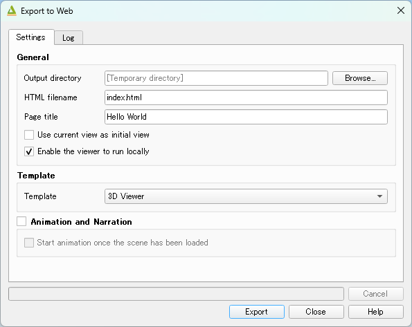
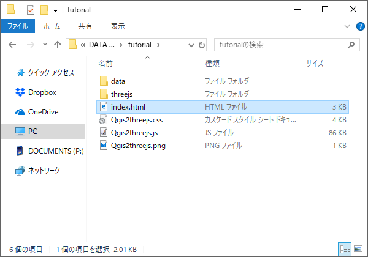

Tutorial
========

Let's start using the Qgis2threejs plugin!

Install the plugin
------------------

Open the Plugin Manager (``Plugins > Manage and Install Plugins...``) and
install the Qgis2threejs plugin.

.. hint:: Need help? See the `9.1. Installing and Managing Plugins`__ section of
   the QGIS training manual.

__ https://docs.qgis.org/3.44/en/docs/training_manual/qgis_plugins/fetching_plugins.html#lesson-installing-and-managing-plugins

Obtain elevation data
---------------------

If you already have raster DEM data, you can skip this step.

NASA has published elevation data generated from the `Shuttle Radar Topography Mission <SRTM_URL_>`_.
This digital topographic data is freely available. SRTM elevation data can be downloaded from
the `EARTHDATA site <SRTM_DATA_URL_>`_ (user registration required).

Download a zip file that contains elevation data for your area of interest from ``EARTHDATA SEARCH``.
The zip file includes a ``.hgt`` file, which can be read by GDAL.

Load DEM data
-------------

Unzip the downloaded file, then drag and drop the ``.hgt`` file into the QGIS window.

CRS setting
-----------

The horizontal unit of SRTM data is degrees, whereas the vertical unit is meters.
For proper visualization, you should transform the DEM data to a projected CRS.
QGIS can perform CRS transformation on the fly.

Change the *current project CRS* to a *projected CRS*.

Click the CRS status icon |CRS_ICON| in the bottom-right corner of the window to
open the project properties dialog, then select a suitable CRS for the DEM extent.
If you are unsure which CRS to use, select the Spherical Mercator projection
(``EPSG:3857``), which is used by many web maps.

.. note:: In the Spherical Mercator projection, feature sizes are horizontally
   enlarged except at the equator.
   At latitude 40° they are enlarged by about 1.3 times, and at 60°, about twice.

Layer styling
-------------

Open the Layer properties dialog for the DEM layer and apply a color scheme.

.. figure:: ./images/tutorial/qgis_styling.png

   Example: use the ``Singleband pseudocolor`` render type and an inverted ``BrBG`` color ramp.

Open the Exporter
-----------------

Zoom to a portion of the DEM so that the map canvas is filled with the colorized DEM layer,
then click the plugin icon |PLUGIN_ICON| in the Web toolbar to open the Qgis2threejs exporter.

The ``Layers`` panel shows the map layers in the current QGIS project that can be added to the 3D scene.
Layers are grouped by type. The DEM layer group includes single-band raster layers and a `Flat Plane`
(a flat surface at a specified altitude).

Multi-band raster layers and raster layers loaded using providers other than GDAL provider are not supported.
Additional flat planes can be added from the ``Scene - Add Layer`` menu.

A preview is displayed on the right. The scene is currently empty.

To add the DEM layer, click the checkbox on the left of the DEM layer in the DEM layer group.

.. image:: ./images/tutorial/exporter1.png

A 3D terrain model with the map canvas image draped over it will appear in the preview.

Export the scene to Web
-----------------------

Select ``File - Export to Web...`` to open this dialog.

Choose an output directory, enable the  ``Enable the Viewer to Run Locally`` option, and click
the ``Export`` button.

.. note:: Most web browsers do not allow data files on the local file system to be loaded via Ajax.
   When ``Enable the Viewer to Run Locally`` is enabled, the plugin embeds geometry and image data
   into a JavaScript file.

Open the exported HTML file in a web browser to view the scene.

.. image:: ./images/tutorial/browser_edge1.png

You can publish the exported 3D viewer by uploading the output folder to a web hosting service
such as Netlify and GitHub Pages.

.. note:: Before publishing, make sure you comply with the data usage terms.

In conclusion
-------------

This tutorial is now complete. You have learned that creating 3D visualizations with QGIS is easy.
With high-quality data, you can create beautiful 3D scenes!

.. tip:: Next, try adding a background map layer to the canvas. You can do this easily with
   the `QuickMapServices plugin`__. You can also add vector data to the scene.
   See :doc:`ShapeTypes` page for examples of available shape types, and :doc:`Exporter` for the detail.

__ https://plugins.qgis.org/plugins/quick_map_services/
