********
Exporter
********

.. contents:: Contents
   :local:
   :depth: 2

Window
======

In the initial state, Qgis2threejs exporter window has `Layers` panel and `Animation` panel on the left side, and a preview
on the right side when preview is available. Each panel can be moved to another position in the window or closed.

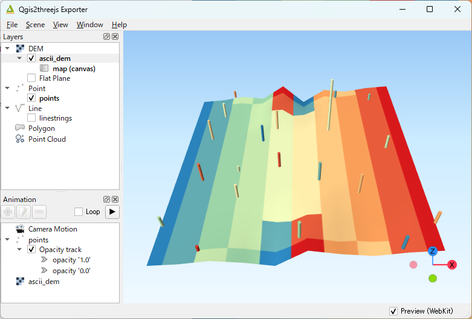

   Qgis2threejs Exporter

In this plugin, the word "export settings" means all configuration settings for a 3D scene and its viewer application.
These include settings for the scene, camera, layers to be exported, animation, widgets on the web page, and more.
You can configure these settings via the `Scene <#scene>`__ menu, the `Layers` panel, the `Animation` panel,
the `View` menu and the `Export to Web` dialog.

The `Layers` panel displays single-band raster and vector layers loaded in QGIS, as well as point cloud layers (partially supported) and flat planes.
Unlike the QGIS layer tree, layers are organized into groups based on their type. Each layer item has a checkbox on its left.
Click the checkbox to add the layer to the current scene. To open the layer properties dialog and configure the layer properties,
double-click the layer item or click `Properties...` from the context menu (right-click menu).

Export settings are automatically saved to a ``.qto3settings`` file alongside the current QGIS project file when you are working
with a QGIS project. When the exporter is opened later, the project's export settings are automatically restored.

The preview is automatically updated whenever export settings are changed.
You can disable the preview by unchecking the `Preview` checkbox in the lower-right corner of the window.

Menu
----

* File

   * Export to Web...
      Exports files for publishing the current scene to the web. See `Export to Web Dialog <#export-to-web-dialog>`__.

   * Save Scene As

      .. _save-image-dialog:

      * Image (.png)...
         Saves the rendered scene as a PNG image file. You can also copy the image to the clipboard.

      * glTF (.gltf,.glb)...
         Saves the 3D model of the current scene in glTF format.

   * Export Settings

      * Load / Save / Clear export settings

   * Plugin Settings...
      Opens the Plugin Settings dialog. See `Plugin Settings <#plugin-settings>`__.

   * Close
      Closes the Qgis2threejs exporter.

.. _scene:

* Scene

   * Scene Settings...
      Opens the Scene Settings dialog. See `Scene Settings <#scene-settings>`__.

   * Add Layer

      * Add Flat Plane
         Adds a flat horizontal plane to the scene. The altitude of the added plane can be changed in the Properties dialog.

      .. _add-point-cloud-layer:

      * Add Point Cloud Layer...
         Adds a point cloud layer to the scene that can be loaded with Potree version 1.6. This feature has not been updated
         in recent years and does not support the Potree 2.0 file format or Cloud Optimized Point Cloud (COPC).
         See also `Point Cloud Layer <#point-cloud-layer>`__.

   * Reload (F5)
      Reloads the web page and rebuilds the current scene.

* View

   * Camera
      Changes the camera. See `Camera Settings <#camera-settings>`__.

   * Widgets
      Configures widgets to be placed on the web page, such as the Navigation widget, the North arrow and the footer label.
      See `Widgets <#widgets>`__.

   * Reset Camera Position (Shift+R)
      Returns the camera to its initial position and resets the focal point to its initial location.

* Window

   * Panels

      * Layers
         Toggles `Layers` panel visibility.

      * Animation
         Toggles `Animation` panel visibility.

   * Always on Top
      Brings the exporter window to the front of all other application windows.

* Help

   * Usage of 3D Viewer
      Displays the controls for the 3D viewer in the web view.

   * Help Contents
      Opens the plugin documentation in the default browser. Requires an internet connection.

   * Plugin Homepage
      Opens the plugin homepage in the default browser. Requires an internet connection.

   * Send Feedback
      Opens the plugin issue tracker in the default browser. Requires an internet connection.

   * About Qgis2threejs Plugin...
      Displays the plugin version.

Scene Settings
==============

Scene settings dialog controls some basic configuration settings for current scene.
Click on ``Scene - Scene Settings...`` menu entry to open the dialog.

World Tab
---------

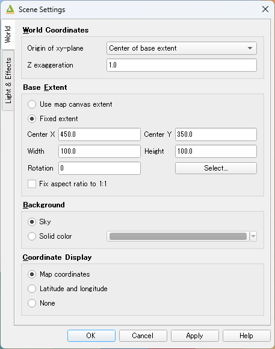

   Scene Settings Dialog - World tab

* World Coordinates

   * Origin of xy-plane

      Specifies where the origin point of the XY plane is located.

      * Center of base extent
         Sets the center of the base extent defined below as the origin of the XY plane.
         Shifting the origin in this way helps maintain numerical precision when coordinate values are very large.

      * Origin of map coordinate system
         Uses the original origin defined in the map coordinate system as the XY plane origin.

   * Z exaggeration

      Specifies the vertical exaggeration factor. This value affects terrain shape and the Z positions of all 3D vector objects.
      It also affects the height of certain volumetric 3D object types.

      The following shape types are affected:

       | Point : Cylinder, Cube, Cone
       | Polygon : Extruded

      The following shape types have volume, but their heights are not affected by this factor:

       | Point : Sphere
       | Line : Pipe, Cone, Box

      The default value is 1.0.

* Base Extent

   Defines the spatial extent used as the base area for the scene.

   Select how the base extent is determined:

   * Use map canvas extent

      Uses the current visible extent of the map canvas as the base extent. The extent automatically
      updates according to changes in the map view.

   * Fixed extent

      Uses a manually specified extent as the base extent. This option allows you to maintain a constant area
      regardless of changes in the map canvas view. The extent values can be set using the extent of a specific
      layer or by interactively selecting an area on the map canvas.

   Additional option:

   * Fix aspect ratio to 1:1

      Keeps the width and height of the base extent at a 1:1 ratio.
      This option is checked by default since version 2.7.

* Background

   Selects either a sky-like gradient or a solid color for the scene background.
   The default setting is Sky.

* Display of coordinates

   If the ``Latitude and longitude (WGS84)`` option is selected, the coordinates of
   the clicked position on a 3D object are displayed as longitude and latitude (WGS84).
   If `Proj4js <https://github.com/proj4js/proj4js>`__ does not support current the map CRS,
   this option is disabled.

Light & Effects Tab
-------------------

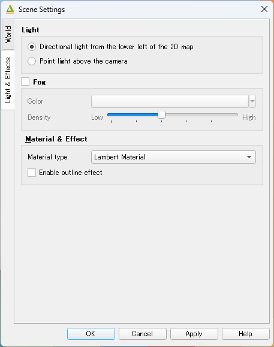

   Scene Settings Dialog - Light & Effects Tab

* Light

   Selects the light source used to illuminate the scene.

   * Directional light from the lower left of the 2D map

      Simulates parallel light rays coming from the lower-left direction of the 2D map (the map displayed in the map canvas view).

   * Point light above the camera

      Simulates a point light source located above the camera position.

* Fog

   Controls the fog effect applied to the scene.

   * Color

      Specifies the color of the fog.

   * Density

      Specifies the density of the fog. Higher values increase the fog effect and reduce the visibility of distant objects.

* Material & Effects

   * Basic material type

      Specifies the material type applied to most 3D objects, except for Point, Billboard, Model File and Line-type objects.
      Select a material type from
      `Lambert material <https://threejs.org/docs/#api/en/materials/MeshLambertMaterial>`__,
      `Phong material <https://threejs.org/docs/#api/en/materials/MeshPhongMaterial>`__ or
      `Toon material <https://threejs.org/docs/#api/en/materials/MeshToonMaterial>`__.
      The default is Lambert material.

   * Enable outline effect

      Enables an outline effect around 3D objects, making object shapes more visually distinguishable.

Camera Settings
===============

* Perspective Camera

   Renders closer objects as larger and farther objects as smaller, creating a realistic sense of depth.

* Orthographic Camera

   The rendered object size does not depend on the distance from the camera.

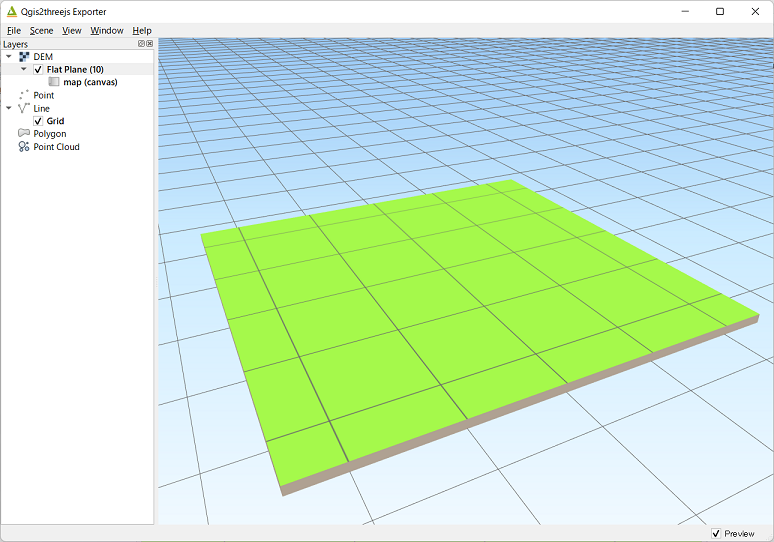

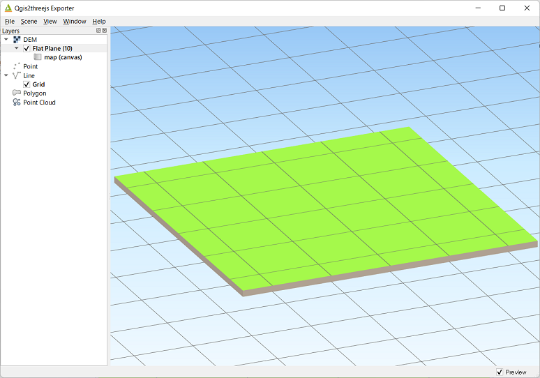

=================== ===================
Perspective camera  Orthographic camera
------------------- -------------------
|persp|             |ortho|
=================== ===================

3D Viewer Controls
==================

Customized OrbitControls for Qgis2threejs are available.

Basic Controls
--------------

======================= =====================================
Mouse / Key             Control
======================= =====================================
Left button + drag      Orbit (rotate around the focal point)
Scroll wheel            Zoom
Right button + drag     Pan (move horizontally)
Arrow keys              Pan (move horizontally)
======================= =====================================

Additional Controls
-------------------

========================== ==========================================
Mouse / Key                Control
========================== ==========================================
Shift + Left button + drag Move perpendicular to the camera direction
========================== ==========================================

Keyboard Shortcuts
------------------

==== ============================
Key  Control
==== ============================
I    Show 3D viewer controls
R    Start / Stop orbit animation
W    Toggle wireframe mode
==== ============================

Widgets
-------

* Navigation widget

   This widget is the `ViewHelper <https://threejs.org/docs/#ViewHelper>`__ provided by three.js. It displays the current
   camera orientation and allows you to align the camera with the X, Y, or Z axis by clicking the corresponding axis button.

.. _north-arrow-dialog:

* North arrow

   Adds an arrow at the lower-left corner of the 3D view indicating grid north, which corresponds to the north
   direction of the map coordinate system.

.. _header-footer-labels:

* Header/Footer label

   Adds a header label to the top of the view and/or a footer label to the bottom.
   The label text can include valid HTML tags for styling.

DEM Layer
=========

Geometry
--------

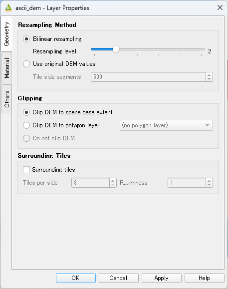

   DEM Layer Properties Dialog - Geometry Tab

✏

* Resampling Method

  * Bilinear resampling

    * Resampling level

      Select a DEM resolution from several levels. This resolution is used to
      resample the DEM, but is not for texture.

  * Use original DEM values

    * Tile side segments

* Clipping

  * Clip DEM to scene base extent

  * Clip DEM to polygon layer

     Clips the DEM with a polygon layer. If you have a polygon layer that
     represents the area that elevation data exist or represents drainage basins,
     you might want to use this option.

  * Do not clip DEM

* Surrounding Tiles

   This option enlarges output DEM by placing DEM blocks around the main block of the map canvas extent.
   Size can be selected from odd numbers in the range of 3 to 9. If you select 3, total 9 (=3x3) blocks
   (a center block and 8 surrounding blocks) are output. Roughness can be selected from powers of 2 in
   the range of 1 to 64. If you select 2, grid point spacing of each surrounding block is doubled. It
   means that the number of grid points in the same area becomes 1/4.

Material
--------

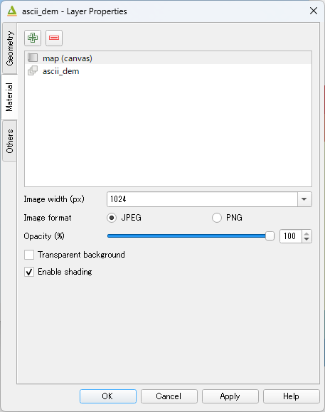

   DEM Layer Properties Dialog - Material Tab

✏

The material list has one item ``map (canvas)`` by default.
You can add a material to the list by clicking + button, selecting one of ``Select layer(s)``, ``Image file``,
``Solid color`` and ``Map canvas layers``.

* Map canvas layers

   Render a texture image with the current map settings for each DEM block.

* Layer image(s)

   Render a texture image with the selected layer(s) for each DEM block.

* Image file

   Textures the main DEM block with existing image file such as PNG file and JPEG file.
   TIFF is not supported by some browser. See `Image format
   support <https://en.wikipedia.org/wiki/Comparison_of_web_browsers#Image_format_support>`__
   for details.

* Solid color

   To select a color, press the button on the right side.

* Image width (px)

   Select width of image draped on each DEM block. Default value is 1024.

* Opaciy

   Sets opacity of DEM object. 100 is opaque, and 0 is transparent.

* Transparent background

   When map canvas image or layer image is chosen

   Makes image background transparent.

* Enable shading

   Adds a shading effect to DEM surface. Checked by default.

Others
------

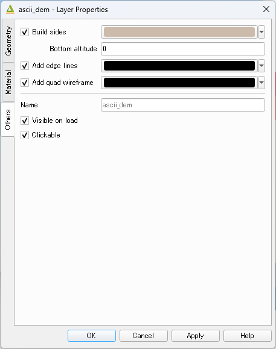

   DEM Layer Properties Dialog - Other Options Tab

✏

* Build sides

   This option adds sides and bottom to each DEM block. The z position of bottom
   in the 3D world is fixed. You can adjust the height of sides by changing
   the value of vertical shift option in the World panel. If you want to
   change color, edit the output JS file directly.

* Add edge lines

   This option adds frame to the DEM. If you want to change color, edit the output
   JS file directly.

* Add quad wireframe

* Name

* Visible on Load

   Whether the layer is visible on page load or not.

* Clickable

Vector Layer
============

Features
--------

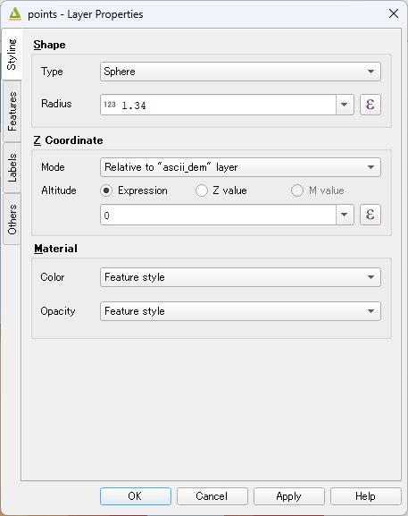

   Vector Layer Properties Dialog - Features Tab

Vector layers are grouped into three types: Point, Line and Polygon.
Common properties for all types:

* Type

  Select a shape type.

* Z coordinate

   * Altitude Mode

      * Absolute

         Altitude is distance above zero-level.

      * Relative to (a DEM layer)

         Altitude is distance above surface of selected DEM.

   * Altitude

      You can use an expression to define altitude of objects above zero-level or
      surface of selected DEM layer. This means that object altitude can be defined
      using field values. The unit is that of the map CRS.

      * Expression

         A numeric value, field or more complex expression (QGIS expressions).

      * Z value / M value

         Uses z coordinate or m value of each vertex. the evaluated value is added to it.

         These options can be chosen when the layer geometries have z coordinates or m values.
         Cannot be chosen when the object type is Extruded or Overlay.

* Geometry and Material

   Usually, there are options to set object color and transparency. Refer
   to the links below for each object type specific properties. The unit of
   value for object size is that of the map CRS.

* Feature

   Select the features to be exported.

   * All features

      All features of the layer are exported.

   * Features that intersect with map canvas extent

      Features on the map canvas are exported.

      * Clip geometries

         This option is available with Line/Polygon layer. If checked, geometries are clipped by the extent of map canvas.

* Attributes

   If the export attributes option is checked, attributes are exported with
   feature geometries. Attributes are displayed when you click an object on
   web browser.

Labels
------

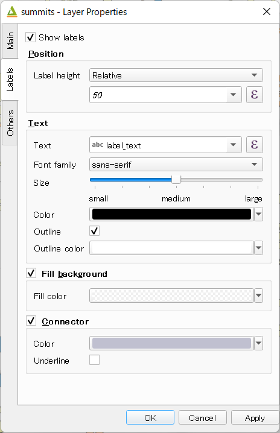

   Vector Layer Properties Dialog - Labels Tab

This combo box is not available when layer type is line.

* Show labels
   a label is displayed above each object.
* Position
* Text
* Fill background
* Connector

Others
------

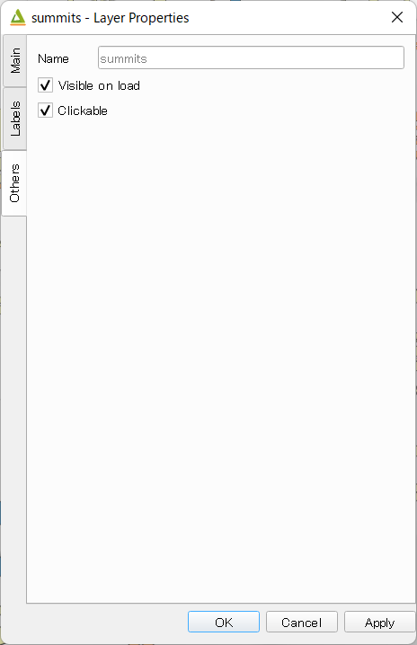

   Vector Layer Properties Dialog - Other Options Tab

* Name

* Visible on Load

   Whether the layer is visible on page load or not.

* Clickable

Point
^^^^^

Point layers in the project are listed as the child items. The following
shape types are available:

   Sphere, Cylinder, Cone, Box, Disk, Plane, Model File

See :ref:`object-types-point-layer` section in :doc:`ObjectTypes` page for each object type specific properties.

Line
^^^^

Line layers in the project are listed as the child items. The following
shape types are available:

   Line, Pipe, Cone, Box, Wall

See :ref:`object-types-line-layer` section in :doc:`ObjectTypes` page for each object type specific properties.

Polygon
^^^^^^^

Polygon layers in the project are listed as the child items. The
following shape types are available:

   Polygon, Extruded, Overlay

See :ref:`object-types-polygon-layer` section in :doc:`ObjectTypes` page for each object type specific properties.

Point Cloud Layer
=================

* Information
  - URL
    - The source/URL of the point cloud.
  - Description
    - Metadata or additional information.

* Material
  * Color type
  * Opacity

* Other options
  * Name
  * Show bounding boxes
    - Toggle display of point-cloud bounding boxes in the viewer.
  * Visible on load
  * Clickable

See also `Add Point Cloud Layer... <#add-point-cloud-layer>`__.

Animation
=========

Animation Panel
---------------

✏

* Camera Motion

  Group and keyframe item.

* Layer

  * Texture change
  * Growing line
  * Change opacity

* Tween

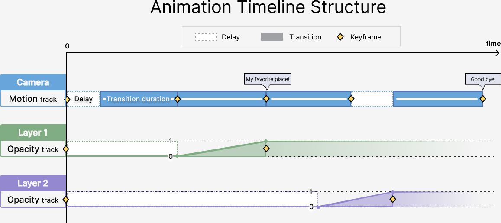

Keyframe Dialog
---------------

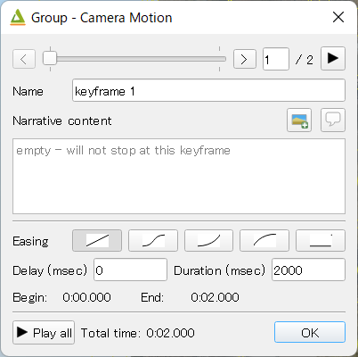

✏

Export to Web Dialog
====================

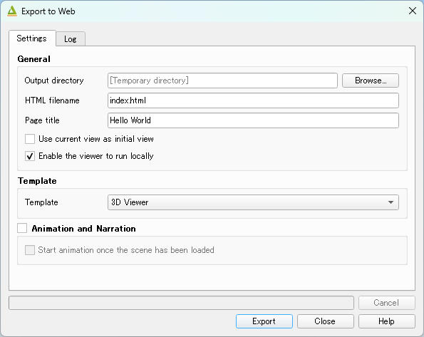

* Output directory and HTML Filename

   Select output HTML file path. Usually, a js file with the same file
   title that contains whole data of geometries and images is output into
   the same directory, and some JavaScript library files are copied
   into the directory. Leave this empty to output into temporary
   directory. Temporary files are removed when you close the QGIS
   application.

* Page title

  ✏

* Preserve the Current Viewpoint

  If checked, the current viewpoint of the preview is used as initial viewpoint.

* Enable the Viewer to Run Locally

  If checked, export all scene data to a .js file to avoid web browser's same origin policy
  security restrictions. You can view the exported scene without uploading it to a web
  server, although the total file size will increase and it will take longer to load.

* Template

   Select a template from available templates:

   * 3DViewer

      This template is a 3D viewer without any additional UI library.

   * 3DViewer(dat-gui)

      This template has a `dat-gui <https://code.google.com/p/dat-gui/>`__
      panel, which makes it possible to toggle layer visibility, adjust layer
      opacity and add a horizontal plane movable in the vertical direction.

   * Mobile

      This is a template for mobile devices, which has mobile friendly GUI,
      device orientation controls and AR feature. In order to use the AR feature
      (Camera and GPS), you need to upload exported files to a web server that
      supports SSL.

      * Magnetic North Direction
         Magnetic North direction clockwise from the upper direction of the map, in degrees.
         This value will be set to 0 if map canvas is rotated so that magnetic North direction is
         same as the map upper direction. Otherwise, the value should be determined taking account of
         grid magnetic angle (angle between grid North and magnetic North) and map rotation.
         Used to determine device camera direction.

* Animation and Narrative

   ✏

   * Start animation once the scene has been loaded

* Export button

   Exporting starts when you press the Export button. When the exporting has
   been done and `Open exported page in web browser` option is checked, the
   exported page is opened in default web browser (or a web browser specified
   in `Plugin Settings <#plugin-settings>`__).

Plugin Settings
===============

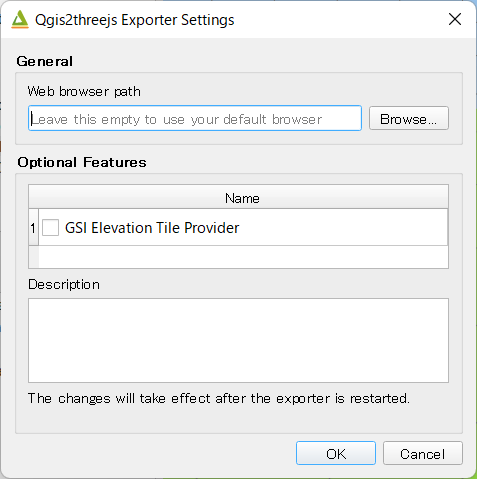

* Web browser path

   If you want to run the exported viewer with a web browser other than the default browser,
   enter path to the web browser in this input box.
   See `Browser Support <https://github.com/minorua/Qgis2threejs/wiki/Browser-Support>`__ wiki page.

* Optional Features

   See `Plugins <https://github.com/minorua/Qgis2threejs/wiki/Plugins>`__ wiki page.
