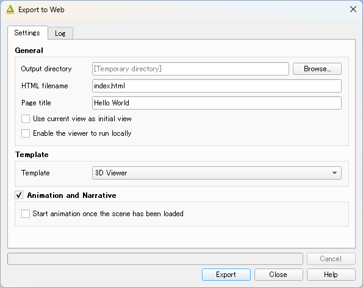

Tutorial
========

Let's start using Qgis2threejs plugin!

Install the plugin
------------------

Open the Plugin Manager (``Plugins > Manage and Install Plugins...``) and
install Qgis2threejs plugin.

.. hint:: Need help? See the `9.1. Installing and Managing Plugins`__ section of
   the QGIS training manual.

__ https://docs.qgis.org/3.22/en/docs/training_manual/qgis_plugins/fetching_plugins.html#ls-installing-and-managing-plugins

Obtain elevation data
---------------------

If you already have raster DEM data, you can skip this step.

NASA published elevation data generated from NASA's
`Shuttle Radar Topography Mission`__ digital topographic data.
We can use the data freely. SRTM elevation data can be
downloaded from the `EarthExplorer`__ (User registration required).

__ https://www2.jpl.nasa.gov/srtm/index.html
__ https://earthexplorer.usgs.gov/

✏

..
  Download a zip file that contains elevation data of the area you are
  interested in from under the ``version2_1/SRTM3`` directory. The zip
  file contains a ``.hgt`` file, which is readable by the GDAL.
..

..
  .. tip:: If the area extends over two or more files, you might want to
      create a virtual mosaic using `Build Virtual Raster`__
      algorithm of Processing GDAL algorithms.
  __ https://docs.qgis.org/3.10/en/docs/user_manual/processing_algs/gdal/rastermiscellaneous.html#build-virtual-raster
..

Load DEM data
-------------

✏

..
  Unzip the downloaded zip file, and then drag & drop ``.hgt`` file
  to QGIS window.
..

CRS setting
-----------

Horizontal unit of SRTM data is degree, whereas vertical unit is meter.
For appropriate visualization, you need to transform the DEM data to
a projected CRS. QGIS can perform the CRS transformation on the fly.

So, let's change the *current project CRS* to a *projected CRS*.

Click the CRS status icon |crs_icon| in the bottom-right corner of the window to
open the project properties dialog, and then select a suitable CRS for the DEM extent.
If you don't know which CRS is best suited, select the Spherical Mercator projection
(``EPSG:3857``), which is adopted by many web maps.

.. note:: In the Spherical Mercator projection, every feature size is horizontally
   larger than actual size except those of features on the equator.
   At latitude 40 degrees it is enlarged 1.3 times, at 60 degrees enlarged twice.

Layer styling
-------------

Open the Layer Properties dialog for the DEM layer and colorize the DEM layer richly.

An example (``Singleband pseudocolor`` render type and inverted ``BrBG`` color map):

.. image:: ./images/tutorial/qgis_styling.png

Open the Exporter
-----------------
Zoom to a part of the DEM layer extent as the map canvas is filled by the colorized DEM layer,
and then click the plugin icon |plugin_icon| in the web toolbar to open the Qgis2threejs exporter.

There is ``Layers`` panel and ``Animation`` panel on the left side of the window.

The ``Layers`` panel shows the map layers in the current QGIS project that can be added to the 3D scene.
Layer items are grouped by type. DEM layer group has 1-band raster layers in current QGIS project and
a `Flat Plane` (a flat plane at an altitude). Multi-band raster layers and raster layers loaded using
a provider other than GDAL provider are not available. Additional flat planes can be added from
``Scene - Add Layer`` menu.

There is a preview on the right side. The scene doesn't contain any 3D objects now.

Let's add the DEM layer into the scene. Just click the checkbox on the left of the DEM layer
under the DEM layer group.

.. image:: ./images/tutorial/exporter1.png

A 3D terrain object with map canvas image draped on it shows up in the preview.

Add another texture to DEM
--------------------------

✏

Export the scene to Web
-----------------------
Click on the ``File - Export to Web...`` menu entry to open this dialog.

Select a directory to export the scene, check ``Enable the Viewer to Run Locally`` option and press ``Export`` button.

.. note:: Most web browsers do not allow loading data files on local file system via Ajax.
   With ``Enable the Viewer to Run Locally`` option the plugin outputs geometry and image data into a js file.

.. image:: ./images/tutorial/exported_directory.png

Open the .html file with a web browser. You can see exported scene in web browser.

.. image:: ./images/tutorial/browser_edge1.png

You can publish the exported 3D viewer application and data just by uploading the output folder to
a web hosting service such as Netlify and GitHub Pages.

.. note:: Please do not forget to ensure that you comply with
   the Terms and use for the data before publishing the data to the web.

Animation and narratives
------------------------

✏

In conclusion
-------------

Tutorial is over. Now you know 3D visualization with QGIS is very easy.
If you can use high-quality data, you can create beautiful 3D scenes!

.. tip:: Next, how about adding a background map layer to the map canvas.
   You can do it easily with `QuickMapServices plugin`__. Also, how about adding
   vector data to the scene. :doc:`ObjectTypes` page has images of various object
   types. See :doc:`Exporter` for the detail.

__ https://plugins.qgis.org/plugins/quick_map_services/
