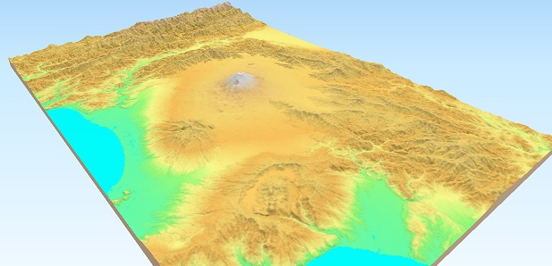

.. Qgis2threejs Plugin documentation master file, created by
   sphinx-quickstart on Fri Jan  5 16:05:27 2024.

Qgis2threejs Plugin Documentation
=================================

Qgis2threejs is a plugin for `QGIS <https://qgis.org/>`_ that provides 3D map
visualization and web publishing functionality using the three.js JavaScript
library. It allows you to render both DEM (digital elevation model) raster
layers and vector layers (points, lines, polygons) as 3D terrain and objects
inside a web browser. You can configure various shape types (e.g., extruded
polygons, 3D-shaped points/lines) and export the result via a simple workflow
to a web-ready format. In addition to HTML/JavaScript output for interactive
web maps, the plugin supports exporting the 3D model to glTF (or glb) format,
enabling further use in 3D graphics applications or 3D printing pipelines.

.. toctree::
   :maxdepth: 1
   :caption: Contents:
   :hidden:

   Examples
   Tutorial
   Exporter
   ShapeTypes
   3DViewer
   Development

:ref:`genindex`, :ref:`search`
