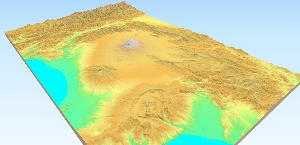

.. Qgis2threejs Plugin documentation master file, created by
   sphinx-quickstart on Fri Jan  5 16:05:27 2024.

Qgis2threejs Plugin Document
============================

Qgis2threejs plugin is a `QGIS <https://qgis.org/>`_ plugin, which visualizes
DEM data and vector data in 3D on a web view. You can build various kinds
of 3D objects and generate files for web publishing in simple procedure.
In addition, you can save the 3D model in glTF format for 3DCG or 3D printing.

Table Of Contents:

.. toctree::
   :maxdepth: 1
   :caption: Contents:

   Examples
   Tutorial
   Exporter
   ObjectTypes
   WebViewerTemplates
   ExportUsingProcessingAlgorithm
   ExportUsingPython
   Development

Indices and tables
==================

* :ref:`genindex`
* :ref:`modindex`
* :ref:`search`
